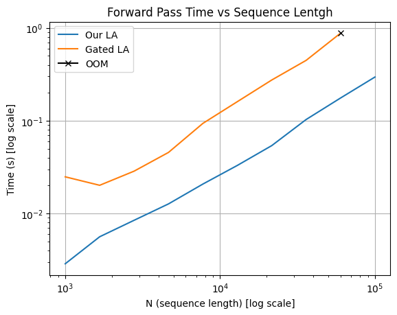
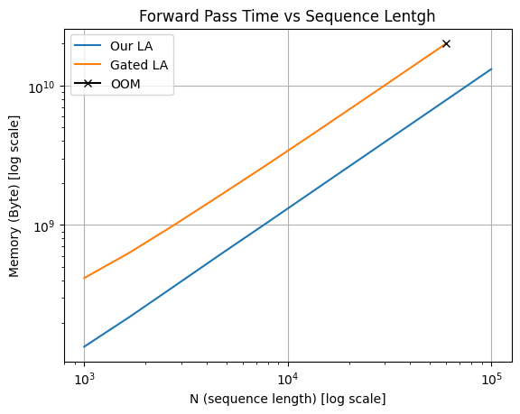

# comparison_with_GLA
This repo shows the comparison between our implementation of Linear Attention (LA) with causal with Gated Linear Attention ([GLA](https://github.com/berlino/gated_linear_attention/tree/main)) on an A6000 GPU. We plots demonstrate the time and memory consumption of a single attention layer with batch size of 4, number of heads 16, dimension per head 128, and token length $[1e^3, 1e^5]$. Our implementation is faster by an order of magnitude and has $3.6\times$ less memory consumption. To reproduce the results, follow the steps below.\
\
\

# Recreate The Results
Install GLA
```
pip install -U git+https://github.com/sustcsonglin/flash-linear-attention
```

Install our library
```
pip install torch==2.6.0
cd linear_attention
module load gcc
module load cuda
python setup_fastmax.py install
```
The "gcc" version must be between 11.0.0 and 13.0.0, and the cuda version after 11.0.0. The library will only be installed if there's an Nvidia GPU accesible.\
Finally, run `profiling.py`.
